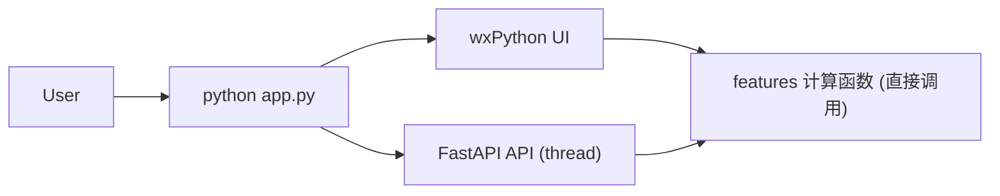

## Minecraft Transit Railway 铁路工程计算系统

[](https://www.python.org/)
[](https://python-poetry.org/)
[](https://fastapi.tiangolo.com/)
[](https://wxpython.org/)

一个针对 Minecraft Transit Railway（MTR）相关铁路工程场景设计的**几何计算工具**，同时提供：

- **HTTP API**：通过 FastAPI 提供多种计算端点，方便程序化整合。
- **桌面图形界面（UI）**：基于 wxPython 的 GUI，适合一般使用者直接操作。

本项目的推荐启动方式是在项目根目录执行：

```bash
python app.py
```

此指令会在**同一个进程中同时启动**：

- 一个在背景执行的 FastAPI 服务器（使用 `uvicorn`，默认位于 `http://127.0.0.1:8000`）
- 一个 wxPython 桌面 UI 窗口，作为主要使用入口

> **重要说明：**目前 UI 会**直接 `import features` 模块并调用计算函数**，并且**不通过本机启动的 HTTP API**。API 主要用于程序化整合或未来扩展用途。

---

## 架构与执行流程概览

在 `app.py` 中：

- 建立一个 FastAPI 应用并以 **子线程（daemon thread）** 启动 `uvicorn.run(...)`。
- 在主线程中调用 `UI.main.run_ui()` 启动 wxPython 主窗口。
- UI 端直接调用 `features` 模块中的计算函数；API 端点同样重用这些函数。

整体流程可以概括如下：



- **wxPython UI**：提供互动式界面，让使用者输入坡度、高度、道岔号数等参数并即时看到结果。
- **FastAPI API**：暴露 HTTP 端点，方便其他程序或服务通过网络调用相同的计算逻辑。

---

## 环境需求与安装方式

### 系统需求

- **Python**：`>= 3.14`（来自 `pyproject.toml` 的 `requires-python` 设定）
- 建议平台：Windows / Linux / macOS（需能安装 `wxPython`，部分平台可能需要额外系统套件）

### 建议安装步骤

推荐使用 `poetry` 管理项目依赖，在项目根目录执行以下步骤即可完成安装：

```bash
poetry install
```

`poetry` 的安装方式请参考其官方文档：[Installation](https://python-poetry.org/docs/#installation)。

---

## 快速开始（Quick Start）

### 同时启动 API 与 UI（默认模式，推荐）

在项目根目录执行：

```bash
python app.py
```

执行后将会看到：

- 一个 **wxPython 桌面 UI 窗口** 弹出，作为主要的操作界面。
- 一个在背景执行的 **FastAPI 服务器**，默认监听 `http://127.0.0.1:8000`。

此时：

- UI 的所有计算行为都会**直接调用 `features` 模块中的函数**，不通过 HTTP。
- 若你有需要，也可以在浏览器或其他客户端对 API 发送 HTTP 请求。
- 如关闭窗口，API也会随之关闭。

### 仅启动 API

如果你只想启动 HTTP API 而不启动 UI，可以通过参数指定模式：

```bash
python app.py --api-only
# 或简写：
python app.py --api
```

在此模式下，程序会在当前进程中**阻塞运行 FastAPI 服务器**，不会启动 wxPython UI。

你也可以继续使用原本的方式直接启动：

```bash
uvicorn app:app --reload
# 或：
python -m uvicorn app:app --reload
```

### 仅启动 UI

如果你只想启动桌面 UI（不启动 API），可以通过参数指定模式：

```bash
python app.py --ui-only
# 或简写：
python app.py --ui
```

在此模式下，仅会启动 wxPython UI，不会开启任何 HTTP API 服务器。

---

## API 功能与示例

API 的路由定义位于 `API/main.py`，核心端点如下（HTTP 方法皆为 `GET`）：

- **`/`**：根端点，返回简单消息，确认服务运作。
- **`/calculate-distance`**
  - **说明**：在固定坡度（斜率）条件下，计算升起指定高度所需的水平距离与坡长。
  - **主要参数**：
    - `slope`：坡度（以斜率表示，非 ‰）。
    - `height`：高度，单位为米。
- **`/calculate_parallel_turnout_distance`**
  - **说明**：在给定转弯半径与平行道岔间距时，计算为满足转弯半径要求所需的前进距离。
  - **主要参数**：
    - `radius`：转弯半径（米）。
    - `spacing`：平行道岔間距（米）。
- **`/calculate_xy_offset`**
  - **说明**：在指定转弯半径与转弯角度（弧度）条件下，计算对应的 x / y 偏移量与进一后的距离。
  - **主要參數**：
    - `radius`：转弯半径（米）。
    - `angle`：转弯角度（弧度）。
- **`/calculate_specific_turnout_radius`**
  - **说明**：在给定道岔号数与道岔间距时，计算对应的转弯半径。
  - **主要參數**：
    - `number`：道岔号数。
    - `spacing`：道岔间距（米，默认值为 `1.435`）。

### 使用示例：以 `curl` 调用 API

确保 API 已启动（例如通过 `python app.py` 或 `uvicorn app:app`），然后在终端中执行：

```bash
curl "http://127.0.0.1:8000/calculate-distance?slope=0.01&height=5"
```

或使用 Python：

```python
import requests

resp = requests.get(
    "http://127.0.0.1:8000/calculate_parallel_turnout_distance",
    params={"radius": 300.0, "spacing": 4.0},
)
print(resp.json())
```

这些端点返回的 JSON 结构中，除了主要数值外，还会附带来自 `sympy` 解算的中间结果（raw/latex/values），方便进一步处理或显示。

---

## 桌面 UI 功能说明

UI 入口在 `UI/main.py`，启动后主窗口会提供下列三大功能区块：

- **计算在固定坡度下升起指定高度所需距离**
  - 输入：坡度（以 ‰ 表示）、高度（米）。
  - 输出：
    - 水平距离。
    - 四舍五入后的距离。
    - 对应坡长。
- **计算平行道岔间距对应所需前进距离**
  - 输入：转弯半径（米）、平行道岔间距（米）。
  - 输出：
    - 前进距离。
    - 以「进一法」处理后的前进距离。
- **计算指定转弯半径与角度的 x / y 偏移量**
  - 输入：
    - 转弯半径（米）。
    - 转弯角度（以「弧度 × π」形式输入，例如 `0.5` 代表 \(0.5\pi\) 弧度）。
  - 输出：
    - x、y 偏移量。
    - 以「进一法」处理后的 x、y 偏移量。

所有这些按钮操作最终都会**直接调用 `features` 模块中的计算函数**，确保 UI 与 API 共用同一套数学逻辑。

---

## 项目结构概览

项目的主要文件与目录如下：

```text
Minecraft-Transit-Railway-Data-Calculation-API/
├─ app.py              # 同时启动 API 与 UI 的入口
├─ API/
│  └─ main.py          # FastAPI 路由定义
├─ UI/
│  └─ main.py          # wxPython 图形界面与事件处理
├─ features/
│  └─ main.py 等       # 实际几何与工程计算函数
└─ pyproject.toml      # 项目设定与依赖声明
```

---

## 授权与贡献

- 本项目采用 **GPL-3.0-or-later** 授权，详细条款请参考对应的授权文件或 GPL 官方说明。
- 欢迎通过 Issue 或 Pull Request 参与贡献，建议流程如下：
  - Fork 本仓库。
  - 建立功能分支，并在其中进行修改。
  - 尽可能附上再现步骤、测试案例或截图，说明变更内容与动机。
  - 提交 Pull Request 并描述修改重点。

如果你有更多对数学模型、使用情境或国际化（例如新增英文 README）的建议，也非常欢迎提出讨论。